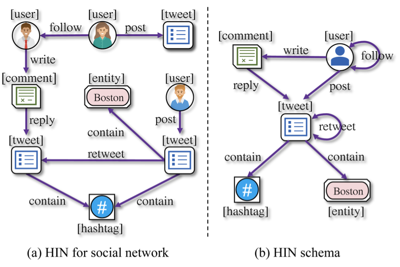
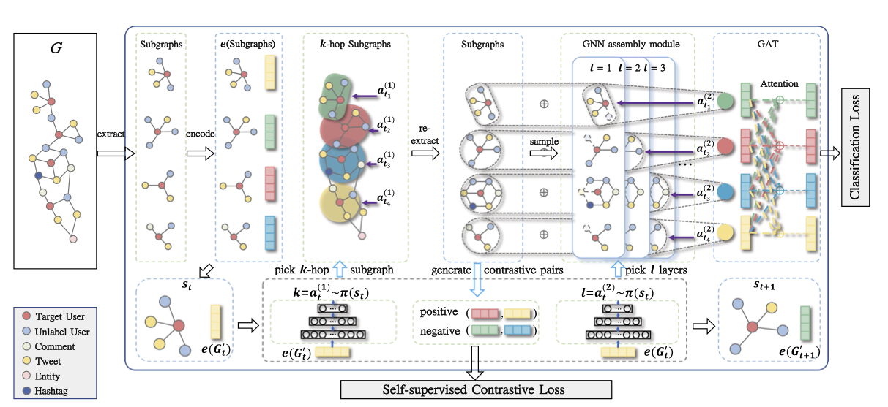
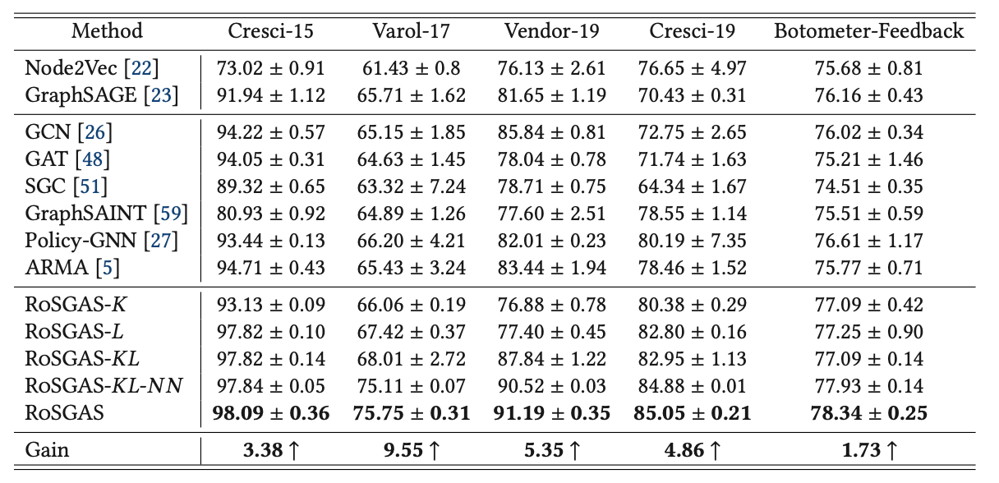
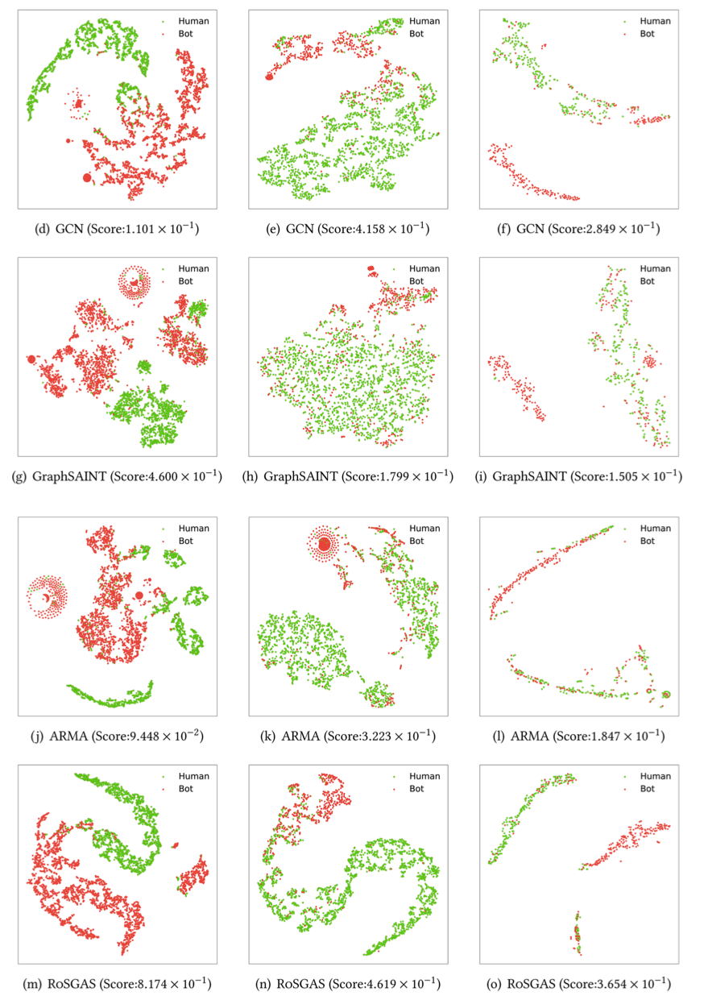

# RoSGAS
code for paper RoSGAS: Adaptive Social Bot Detection with Reinforced Self-Supervised GNN Architecture Search Which was accepted by the ACM Transactions on the Web (TWEB)
This version didn't contain the processed datas in it, if you want to use it you should construct the graphs which can be feed in to the PyG framework. And the details can be found in the SocialData.py

# Run RoSGAS
The main.py is used for training RoSGAS for social bots detection.

```python
python main.py
```
To train the RoSGAS.
# Heterogeneous social graph schema


# Model


# Results




# Citation
```
@article{10.1145/3572403,
author = {Yang, Yingguang and Yang, Renyu and Li, Yangyang and Cui, Kai and Yang, Zhiqin and Wang, Yue and Xu, Jie and Xie, Haiyong},
title = {RoSGAS: Adaptive Social Bot Detection with Reinforced Self-Supervised GNN Architecture Search},
year = {2023},
issue_date = {August 2023},
publisher = {Association for Computing Machinery},
address = {New York, NY, USA},
volume = {17},
number = {3},
issn = {1559-1131},
url = {https://doi.org/10.1145/3572403},
doi = {10.1145/3572403},
abstract = {Social bots are referred to as the automated accounts on social networks that make attempts to behave like humans. While Graph Neural Networks (GNNs) have been massively applied to the field of social bot detection, a huge amount of domain expertise and prior knowledge is heavily engaged in the state-of-the-art approaches to design a dedicated neural network architecture for a specific classification task. Involving oversized nodes and network layers in the model design, however, usually causes the over-smoothing problem and the lack of embedding discrimination. In this article, we propose RoSGAS, a novel Reinforced and Self-supervised GNN Architecture Search framework to adaptively pinpoint the most suitable multi-hop neighborhood and the number of layers in the GNN architecture. More specifically, we consider the social bot detection problem as a user-centric subgraph embedding and classification task. We exploit the heterogeneous information network to present the user connectivity by leveraging account metadata, relationships, behavioral features, and content features. RoSGAS uses a multi-agent deep reinforcement learning (RL), 31 pages. mechanism for navigating the search of optimal neighborhood and network layers to learn individually the subgraph embedding for each target user. A nearest neighbor mechanism is developed for accelerating the RL training process, and RoSGAS can learn more discriminative subgraph embedding with the aid of self-supervised learning. Experiments on five Twitter datasets show that RoSGAS outperforms the state-of-the-art approaches in terms of accuracy, training efficiency, and stability and has better generalization when handling unseen samples.},
journal = {ACM Trans. Web},
month = {may},
articleno = {15},
numpages = {31},
keywords = {Graph neural network, reinforcement learning, architecture search}
}
```

---

Have a nice day.
